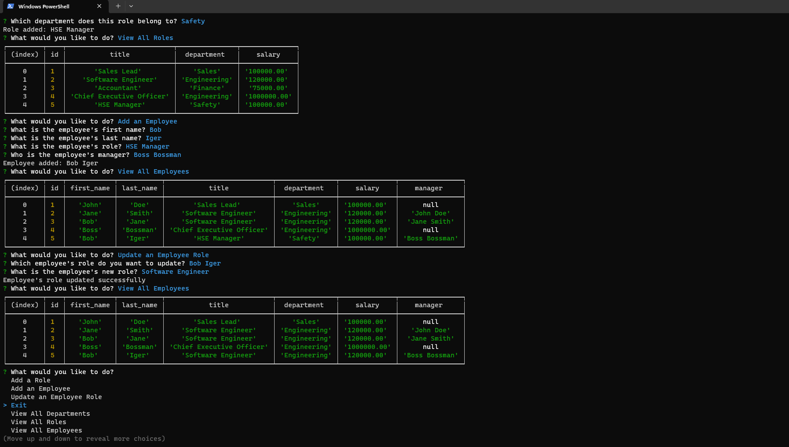

# Varnas Employee Tracker

Employee Tracker is a command-line application built to manage a company's employee database. It allows users to view, add, update, and manage departments, roles, and employee records. This system is designed to help businesses organize and plan their operations more effectively.



## Table of Contents

- [Features](#features)
- [Installation](#installation)
- [Usage](#usage)
- [Links](#links)
- [Technologies Used](#technologies)
- [Contributing](#contributing)
- [License](#license)

## Features

- View all departments, roles, and employees
- Add new departments, roles, and employees
- Update employee roles
- Intuitive and interactive command-line interface

## Installation

To install the application, follow these steps:

1. Clone the repository to your local machine:

   ```bash
   git clone https://github.com/KobayashiKerfuffle/varnas-employee-tracker.git
   ```

2. Navigate to the project directory:

   ```bash
   cd varnas-employee-tracker
   ```

3. Install dependencies:

   ```bash
   npm install
   ```

## Usage

To use the application, follow these steps:

1. Ensure you have MySQL installed and running on your machine.
2. Set up the database using the `schema.sql` and `seeds.sql` files provided in the repository.
3. Run the application.
4. Follow the prompts to view, add, or update departments, roles, and employees.

## Links

- Click here for the [Github Repo](https://github.com/KobayashiKerfuffle/varnas-employee-tracker.git).
- Click here for the [Walkthrough Video](./assets/videos/demo.mp4).

## Technologies
- Node.js
- Inquirer.js
- MySQL
- JavaScript

## Contributing

Contributions to the Note Taker application are welcome!
If you have suggestions for improvements, please open an issue or submit a pull request.

## License

This project is licensed under the [MIT License](LICENSE).